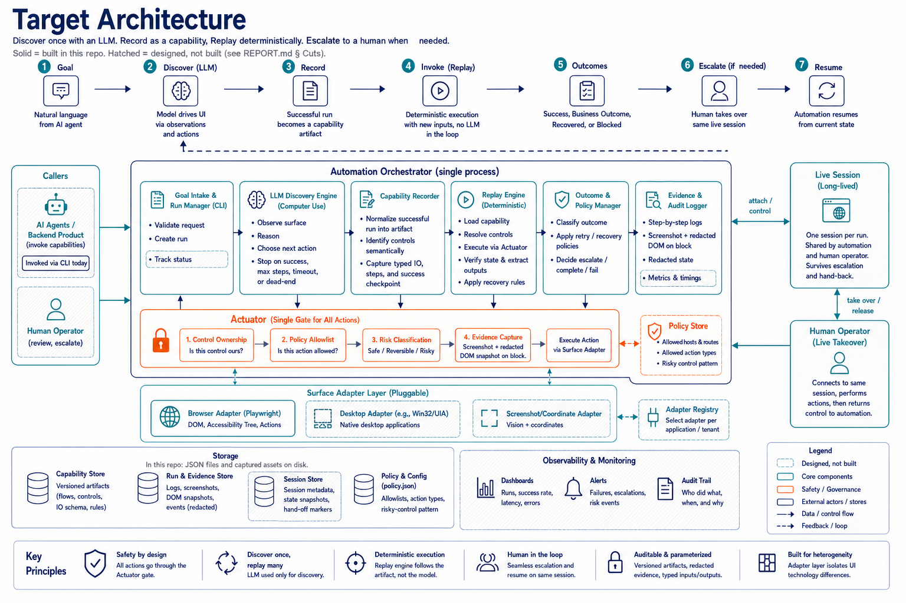

# Rote

Rote uses an LLM to discover a UI workflow once, records it as a typed capability, and replays it deterministically without an LLM.

The target is a local AltoroJ legacy-banking surface with changing IDs, nested tables, an authenticated iframe, canvas-only balance output, deterministic exceptional states, and same-session human handoff.



Solid components are built in this repository; hatched ones are designed and
documented but not implemented — see [`REPORT.md`](REPORT.md) § Cuts.

## Third-party components

`target/altoroj/` is **not my work**. It is [AltoroJ](https://github.com/AppSecDev/AltoroJ), an
open-source sample banking application by AppSecDev, vendored here under the Apache License 2.0.
Its original `LICENSE` and `README.md` are retained unchanged in that directory.

I modified it to act as a stand-in for a hostile legacy bank surface. Those modifications — and
only those — are mine, and every one is listed in
[`target/altoroj/CHALLENGE_VARIANT.md`](target/altoroj/CHALLENGE_VARIANT.md): per-session control
IDs, an authenticated nested iframe, canvas-only balance rendering, and the deterministic scenario
records that produce each exceptional state.

Everything outside `target/` — `src/`, `tests/`, `capabilities/`, `policy.json`, and the evidence —
is my own work. `ocr-data/eng.traineddata.gz` is the Tesseract English model, redistributed under
its own upstream terms; see `ocr-data/README.md`.

## Prerequisites

- Node.js 20+
- Docker Desktop with Compose
- An OpenAI API key, for a new discovery run only

No host Java installation is required. Replay uses local OCR and needs no OpenAI key.

## Setup

Commands are given for bash first, then PowerShell. Everything else is identical.

```bash
docker compose up --build -d
npm install
export PLAYWRIGHT_BROWSERS_PATH="$PWD/.playwright-browsers"
npx playwright install chromium
npm run check
npm test
```

```powershell
docker compose up --build -d
npm install
$env:PLAYWRIGHT_BROWSERS_PATH = "$PWD\.playwright-browsers"
npx playwright install chromium
npm run check
npm test
```

AltoroJ comes up at `http://localhost:8083/altoromutual/`. Synthetic credentials: `jsmith` / `demo1234`.

For discovery only, copy `.env.example` to `.env` and set `OPENAI_API_KEY`. Never commit `.env`.

## Configuration

| Setting | Where | Default |
|---|---|---|
| Target entry point | `--target` flag, else `ROTE_TARGET_URL` | `http://localhost:8083/altoromutual/` |
| Headed browser | `ROTE_HEADLESS` | `false` |
| Guardrail policy | `ROTE_POLICY_PATH` | `policy.json` |
| Discovery model | `OPENAI_MODEL` | `gpt-5.6-terra` |

`policy.json` is the allowlist: permitted hosts, route prefixes, action types, and the risky-control pattern. Edit it to change enforcement — no code change and no rebuild. `{{targetHost}}` and `{{targetPath}}` are substituted from the resolved target so the shipped file works against any entry point.

## Demo: genuine discovery

Runs the OpenAI-driven observe → decide → act loop against the live target and records the capability.

```bash
export ROTE_HEADLESS=false
npm run discover -- \
  --target "http://localhost:8083/altoromutual/" \
  --goal "Sign in to the challenged AltoroJ surface with synthetic username jsmith and password demo1234, inspect account 800002 in the nested legacy console, visually read the canvas-rendered Available balance, and return it as output balance." \
  --record altoroj-final-discovered-account-balance --application AltoroJ \
  --success-text "Available balance" --success-kind visual-text-visible \
  --output-label "Available balance" --output-kind visual-text-near-label \
  --input username=jsmith --input password=demo1234 --input accountId=800002 \
  --evidence altoroj-final-openai-discovery
```

```powershell
$env:ROTE_HEADLESS = "false"
npm run discover -- --target "http://localhost:8083/altoromutual/" --goal "Sign in to the challenged AltoroJ surface with synthetic username jsmith and password demo1234, inspect account 800002 in the nested legacy console, visually read the canvas-rendered Available balance, and return it as output balance." --record altoroj-final-discovered-account-balance --application AltoroJ --success-text "Available balance" --success-kind visual-text-visible --output-label "Available balance" --output-kind visual-text-near-label --input username=jsmith --input password=demo1234 --input accountId=800002 --evidence altoroj-final-openai-discovery
```

The committed discovery log is `evidence/altoroj-final-openai-discovery.json`. It holds no raw model transcript and no persisted password. `evidence/altoroj-final-artifact-review.json` records the parameterisation and iframe/canvas extraction refinement applied after the first fail-closed replay.

## Demo: deterministic replay

Replay never calls OpenAI. It executes the committed artifact with fixed steps, checks the visual success condition, and reads the canvas-rendered balance through local OCR.

```bash
npm run replay -- \
  --capability capabilities/altoroj-final-discovered-account-balance/v1.json \
  --input username=jsmith --input password=demo1234 --input accountId=800002 \
  --evidence altoroj-reviewer-replay
```

```powershell
npm run replay -- --capability capabilities/altoroj-final-discovered-account-balance/v1.json --input username=jsmith --input password=demo1234 --input accountId=800002 --evidence altoroj-reviewer-replay
```

Expected result:

```json
{"status":"success","outputs":{"balance":10000.42}}
```

"Without live services" means no OpenAI and no external OCR service. The local Dockerised target must still be running.

## Exceptional states

Run the same replay command against `capabilities/altoroj-challenge-account-balance/v2.json` with these synthetic records.

| Account record | Result class | Result |
|---|---|---|
| `800002` | success | Balance returned |
| `ABC` | business outcome | Validation error |
| `999999` | business outcome | Account not found |
| `408408` | business outcome | Session expired |
| `555555` | business outcome | Unexpected dialog: unposted transaction hold |
| `777777` | recoverable | Maintenance interstitial dismissed, run continues, recovery reported |
| `403403` | blocked | Permission denied |
| `503503` | blocked | Delayed service unavailable |
| `888888` | blocked | Human intervention required (see below) |

Every blocked result writes a screenshot, a DOM snapshot of the main document and every child frame, and a metadata file to `evidence/failures/<run-id>/`, and returns its path as `evidenceRef`. Sensitive values are stripped first.

## Same-session human handoff

```bash
export ROTE_HEADLESS=false
npm run replay -- \
  --capability capabilities/altoroj-challenge-account-balance/v2.json \
  --input username=jsmith --input password=demo1234 --input accountId=888888 \
  --handoff --evidence altoroj-handoff
```

```powershell
$env:ROTE_HEADLESS = "false"
npm run replay -- --capability capabilities/altoroj-challenge-account-balance/v2.json --input username=jsmith --input password=demo1234 --input accountId=888888 --handoff --evidence altoroj-handoff
```

The intervention request is printed before control transfers: capability, goal, the step it stopped at, what was observed, why it stopped, and the evidence reference. When Chromium shows **Operator Verification Required**, click **Operator resolved - resume automation**. Rote detects the cleared gate, verifies it independently, takes the session lease back, and resumes from the step where it stopped — same session, no re-navigation. The evidence file carries the intervention request, the ownership timeline including the human's action, and the final result.

## Stopping conditions and safety

Discovery accepts `--max-steps` and `--timeout-ms`, and stops when the same observation and action repeat. Every action crosses the actuator, which asserts the session lease, enforces the host/route/action allowlist, and blocks risky controls. Artifacts, logs and failure evidence carry synthetic, redacted values only.

## Stop the target

```bash
docker compose down
```
